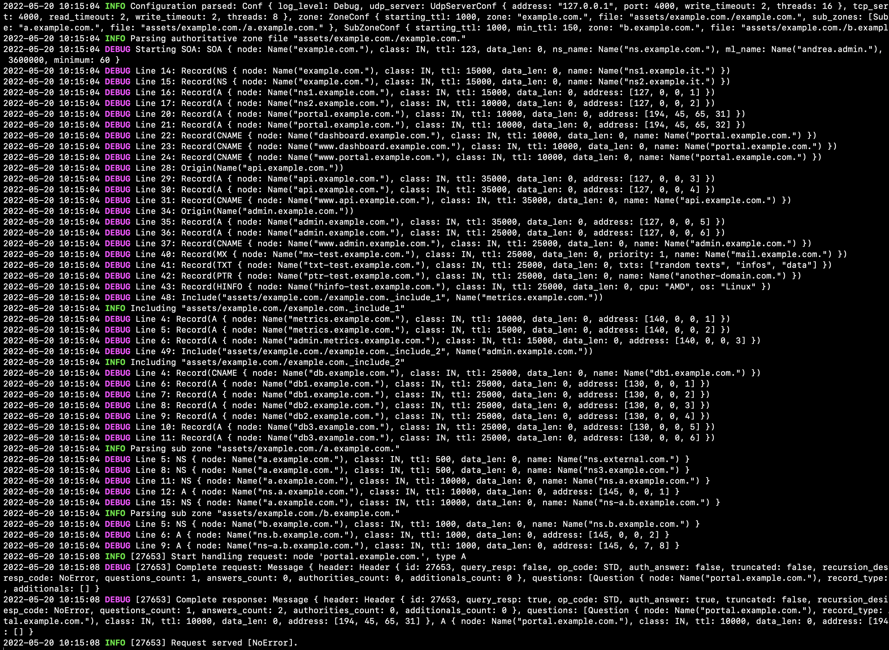
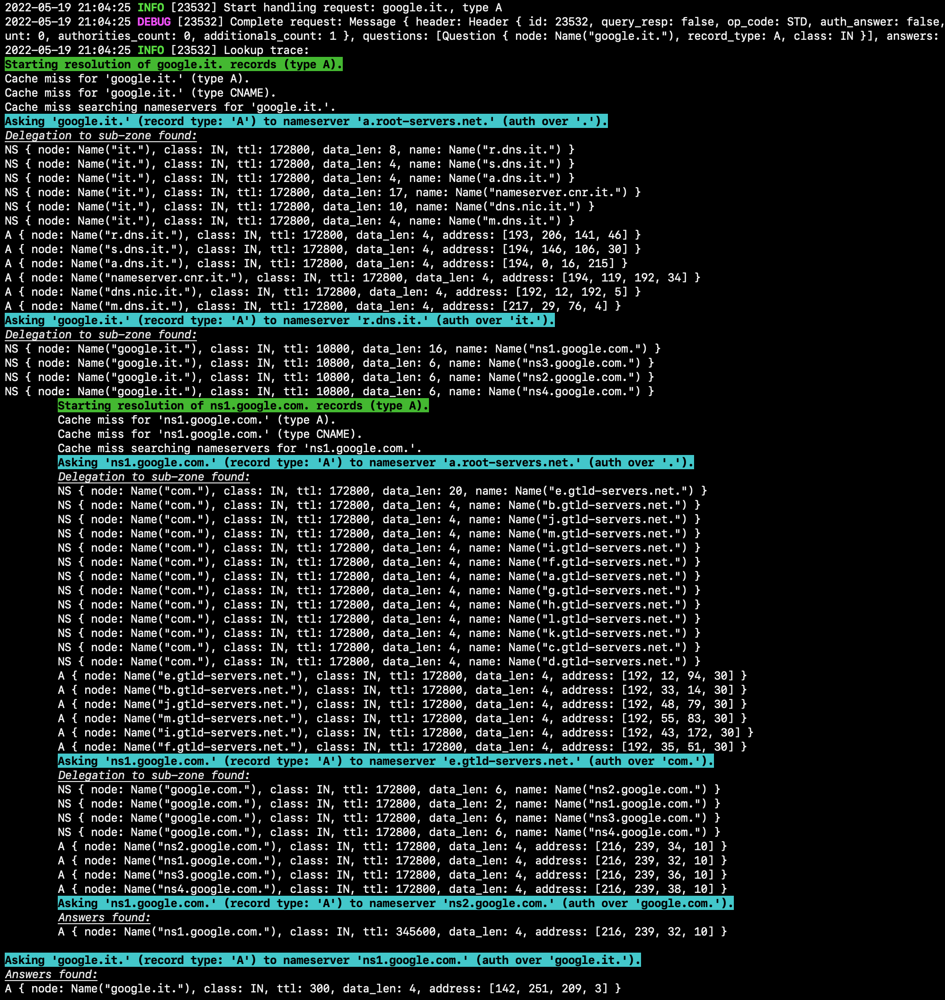

# Ariadne DNS
[](https://github.com/anBertoli/ariadne-dns/actions/workflows/tests.yml)

_Ariadne DNS_ is a compact Rust implementation of a recursive DNS resolver and DNS nameserver,
implementing core RFCs 1034 and 1035. Two separate binaries are present for the two services.

The project is not (yet) intended to be used in production environments, beside testing
environments. Several RFCs should still be implemented and more testing should be performed.
Comments and pull requests are welcome and encouraged, for either new features implementations,
fixes or other improvements.

Table of contents:
- [nameserver](#nameserver)
- [resolver](#resolver)
- [network](#Network)
- [future plans](<#Future-plans>)
- [dev mode](<#Dev-mode>)
- [notes](<#Notes>)

## Nameserver

A nameserver is queried by DNS clients to retrieve records included in zones on which it is authoritative.
The nameserver authoritative zones (e.g. `example.com`) are the parts of the DNS hierarchy directly managed by
the server. These zones could contain sub zones (e.g. `app.example.com` or `dashboard.example.com`). Sub zones
are managed by other nameservers. The `example.com` server is not authoritative over its sub zones.

The `example.com` nameserver delegates to sub zone nameservers queries related to DNS nodes contained in those
sub zones (e.g. `asset.app.example.com`). In the same way the upper zone (e.g. `.com`) nameservers contain
records about our nameservers, as non-authoritative data.

The nameserver is configured via a configuration file, whose path must be provided as the first argument of the
executable. Zone files are loaded at server start-up. These files follow the usual zone files syntax, as showed
in the example below (more examples at [_assets/example.com._](./assets/example.com.)).

```bind
;;;;;;;;;;;; Zone file for "example.com." ;;;;;;;;;;;;

; The starting SOA is mandatory.
example.com. IN 123 SOA ns.example.com. andrea.admin. (
        20       ;SERIAL
        7200     ;REFRESH
        600      ;RETRY
        3600000  ;EXPIRE
        60       ;MINIMUM
)

; Setup nameservers for "example.com".
example.com.      IN        15000       NS      ns1.example.it.
example.com.      IN        15000       NS      ns2.example.it.
ns1.example.com.                        A       127.0.0.1
ns2.example.com.            10000       A       127.0.0.2

; Setup records for an application/service.
portal.example.com.                     A       194.45.65.31
portal.example.com.                     A       194.45.65.32
dashboard.example.com.                  CNAME   portal.example.com.
www.dashboard.example.com.              CNAME   portal.example.com.
www.portal.example.com.                 CNAME   portal.example.com.

; Setup records for another application/service.
$ORIGIN api.example.com.
@                           35000       A       127.0.0.3
                                        A       127.0.0.4
www                                     CNAME   @

; Setup records for an administrative portal.
$ORIGIN admin.example.com.
                                        A       127.0.0.5
                            25000       A       127.0.0.6
www.admin.example.com.                  CNAME   @

; Some examples of other supported records.
mx-test.example.com.                    MX      1      mail.example.com.
txt-test.example.com.                   TXT     "random texts" "infos" data
ptr-test.example.com.                   PTR     another-domain.com.
hinfo-test.example.com.                 HINFO   AMD     Linux

; Include other files. These files are included in this zone and are NOT subzones.
$INCLUDE assets/zones/example.com./example.com._include_1     metrics.example.com.
$INCLUDE assets/zones/example.com./example.com._include_2
```

Some basic validations are made:

- For authoritative records:
  - NS records must be present (SOA record is already checked during parsing),
  - NS records must be owned by the top node of the zone

- For sub zones records:
  - only NS and A records can be present in subzones, NS records must be at top node
  - NS records: if the nameserver is contained in any subzone the sub zone must have glue records for it
  - A records: should provide the address of one of the mentioned nameservers.

Currently, the nameserver in this project supports only one auth zone (it will be extended in the future).
If debug log level is enabled, records are printed at start-up, to validate and debug issues easily.

Example:



### Compile and run the binary

Compile the resolver binary (local architecture):
```sh
cargo build --release --bin nameserver
```

The executable can be found at `/<project-root>/target/release/nameserver`, run it
passing the path of the configuration file as the first argument:
```sh
/path/to/nameserver/binary /etc/conf/nameserver.conf.json
```

## Resolver
A resolver is queried by DNS clients to resolve a name on their behalf. Results are cached for faster lookups
in the future. Different resolver types exist. The so-called _stub resolver_ simply forwards the request to
another DNS server/resolver. _Recursive resolvers_ autonomously resolve the query descending the DNS hierarchy,
starting from the Internet root servers.

The resolver in this project is a recursive one. It can be used from any DNS client to resolve any type of
query. As mentioned before, results are cached for faster lookups in the future. Similarly, nameservers
queried during lookups are cached together with the zone over which they are authoritative.

The resolver is configured via a configuration file, whose path must be provided as the first argument
of the executable. Among other parameters, tracing of lookups can be controlled via the `trace_conf`
field (full tracing it's expensive, turn it on only when needed). If tracing is enabled, after every
lookup the full trace is printed on std_out. The produced trace reports both queried nameserver and their
responses and cache lookups.

Example, querying the resolver (local instance) for `google.it` with:

```sh
dig +retry=0 -p 4000 @127.0.0.1 portal.example.com.
```

Produces the following trace:



### Compile and run the binary

Compile the resolver binary (local architecture):
```sh
cargo build --release --bin resolver
```

The executable can be found at `/<project-root>/target/release/resolver`, run it
providing the path of the configuration file as the first argument:
```sh
/path/to/resolver/binary /etc/conf/resolver.conf.json
```

## Network

The resolver and the nameserver support both UDP and TCP transports, as expected from DNS implementations.
In other words, both the binaries spin up two servers when executed. The two servers are independently
configurable.

Currently, DNS request are handled with a thread pool. Incoming requests are queued in dedicated queue and as
soon as a thread is not busy, a request is dequeued and processed. Next versions of this project will implement
more efficient servers, via async Rust (feel free to contribute).

## Future plans

Implemented RFCs:
- [RFC 1034](https://datatracker.ietf.org/doc/html/rfc1034)
- [RFC 1035](https://datatracker.ietf.org/doc/html/rfc1034)

Some important features from other RFCs are still missing: eDNS, DNSSEC, and others. Contact me if you want to
contribute on these. Some other vital things are missing, in particular: complete codebase testing, async Rust
in server implementations, better DNS cache implementation.

## Dev mode

### Live reload

To run checks and live reload the checks:
```sh
# Live reload of cargo check.
cargo watch
```

To run binaries and live reload them:
```sh
# Live reload using the argument string.
cargo watch -s "cargo run --bin <resolver|nameserver> conf/<resolver|nameserver>.conf.json"
```

The `RUSTFLAGS` can be used to disable compiler warnings:
```sh
RUSTFLAGS="-A warnings" cargo watch
```

### Generate and save packets in files

In one terminal start `netcat` to listen on one port and save the input on a file. Use `dig` to send a request to
that port. The generated file will have the binary content of the DNS request.
```sh
# Terminal 1
nc -u -l 1053 > tmp/query_packet_bin.txt
```
```sh
# Terminal 2
dig +retry=0 -p 1053 @127.0.0.1 +noedns google.com
```

To obtain and save the response of the previous request use `netcat` again. Read the request from the file,
redirect it to a nameserver of your choice and save the response to another file.
```sh
# 198.41.0.4 is a root nameserver
nc -u 198.41.0.4 53 < tmp/query_packet_bin.txt > tmp/response_packet_bin.txt
```

That's the binary content. To produce the more useful hex representation use `hexdump`.
```sh
hexdump -C tmp/query_packet_bin.txt > tmp/query_packet_hex.txt
hexdump -C tmp/response_packet_bin.txt > tmp/response_packet_hex.txt
# Output:
# 00000000  86 2a 81 80 00 01 00 01  00 00 00 00 06 67 6f 6f  |.*...........goo|
# 00000010  67 6c 65 03 63 6f 6d 00  00 01 00 01 c0 0c 00 01  |gle.com.........|
# ...
```

## Notes

Comments and pull requests are welcome and encouraged.

Author: Andrea Bertoli, andrea.bertpp@gmail.com
